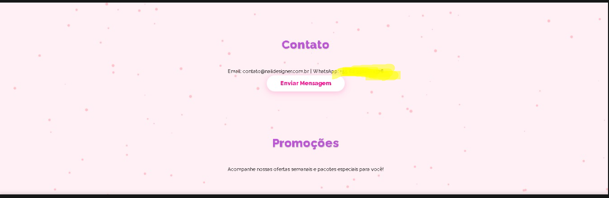
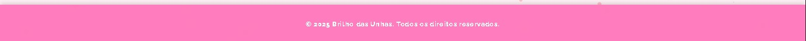
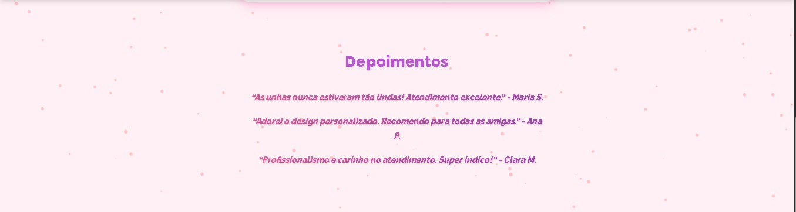
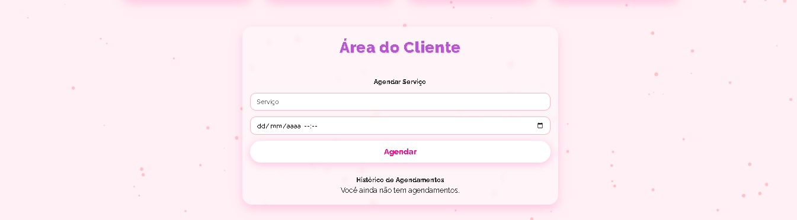
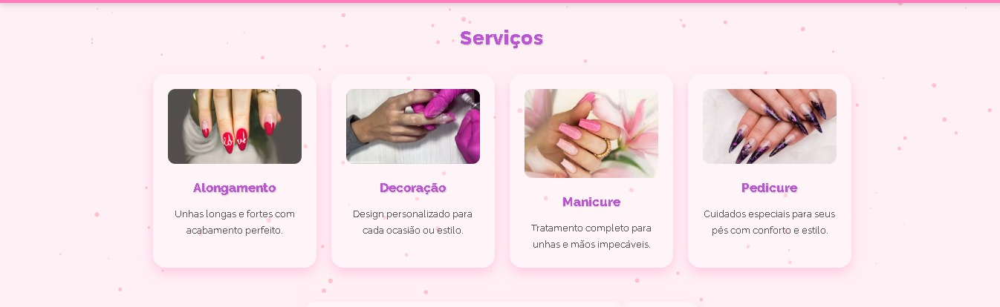
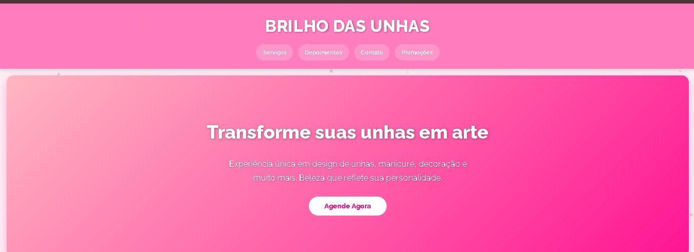

💅 Brilho das Unhas – Glamour e Tecnologia


Bem-vindo ao **Brilho das Unhas**, um projeto que combina **design moderno**, **animações fluidas** e **interatividade inteligente**.  
Este projeto foi criado para proporcionar uma **experiência visual sofisticada** e **funcionalidade intuitiva** em uma landing page de estética e beleza.

---


Um toque de beleza em cada detalhe — veja um pouco do nosso trabalho e do visual do estúdio ✨  

<p align="center">
  
</p>

<p align="center">
  
  
  
</p>

<p align="center">
  
  
</p>


---

## ✨ Funcionalidades

- Interface moderna e responsiva em tons **rosa e roxo glamour**  
- Sistema de **agendamento de serviços** totalmente no front-end  
- Histórico de agendamentos local (sem backend)  
- Efeitos visuais com **flocos de neve rosas fluindo pela tela**  
- Conexão automática com **WhatsApp** para contato e agendamento rápido  
- Animações Ruby simuladas para interação visual

---

## 🖥️ Estrutura do Projeto

📁 BrilhoDasUnhas
├── index.html # Página principal com design e funcionalidades
├── animations.rb # Efeitos animados e interativos em Ruby
├── log_error.php # Registro de logs e mensagens enviadas
├── GET.rb # Simulação de integração GET com API
└── README.md # Documentação do projeto

yaml
Copiar código

---

## 💎 Arquivo `animations.rb`

O arquivo `animations.rb` contém funções simuladas em Ruby que representam ações visuais animadas, como:

```ruby
def hover_animation(element)
  puts "Adicionar hover animation em #{element}"
end

def fade_in(element, duration=0.5)
  puts "Aplicar fade in em #{element} durante #{duration}s"
end
Essas funções simbolizam efeitos utilizados no front-end, tornando o código mais modular e artístico.

📱 Integração WhatsApp
O botão Enviar Mensagem abre automaticamente o WhatsApp com uma mensagem pré-formatada:

“No GlamNails Studio, oferecemos:
✨ Alongamento e fortalecimento das unhas
✨ Decoração exclusiva e personalizada
✨ Tendências de Nail Art
✨ Atendimento acolhedor e profissional”

🧠 Tecnologias Utilizadas
HTML5 / CSS3 / JavaScript

Ruby (simulação de interação front-end)

Canvas API (para partículas e flocos de neve)

Google Fonts (Raleway)

WhatsApp API

💜 Desenvolvido por REALMSCRAFT(TIOASH)
discord:ashwese1140
linkedin:https://www.linkedin.com/in/joao-igor-25b090250/


lembrando:Esse é exclusivo para o TRD
foi feito com o pedido dele.
arquivo não será disponibilizado, possui senha>

as fotos vão está disponiveis no MD.

⚙️ Licença

Licenciado sob Creative Commons BY-NC-ND 4.0
Uso permitido apenas para fins educacionais e não comerciais.


© 2025 – Todos os direitos reservados
